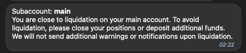

# FTXNotifications

This tool allows you to forward all notifications from the [FTX](https://ftx.com/referrals#a=premiums) UI to a Telegram bot. Notifications are sent for 
withdrawals, deposits, filled orders, liquidations etc.

## Screenshots

 
 
 
 

## Setup

Create a [Telegram bot](https://core.telegram.org/bots#3-how-do-i-create-a-bot) and add it to a chat. This should give 
you a chat id and a bot token.

Create an [FTX API key](https://ftx.com/settings/api#a=premiums). This key can be read-only and doesn't have to be 
created in the main account.

```
cp .env-example .env
```

Fill in the `.env` file with the correct settings.

```bash
python3 -m venv venv
source venv/bin/activate
pip install -r requirements.txt
python -m ftxnotifications.main
```

Your bot should now be up and running. Notifications will be printed in console and sent through Telegram.